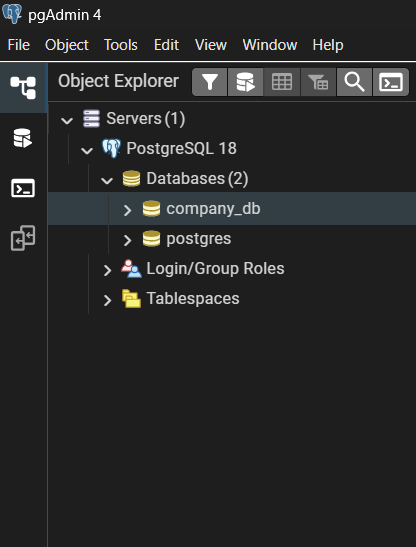
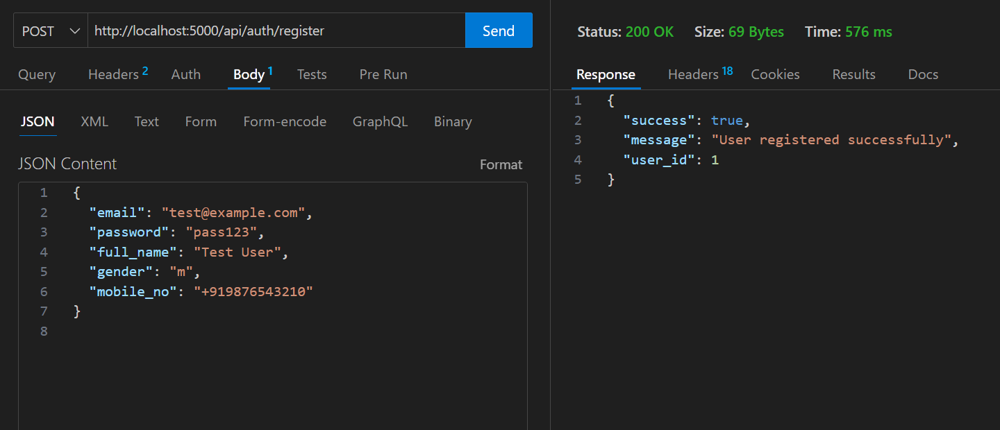
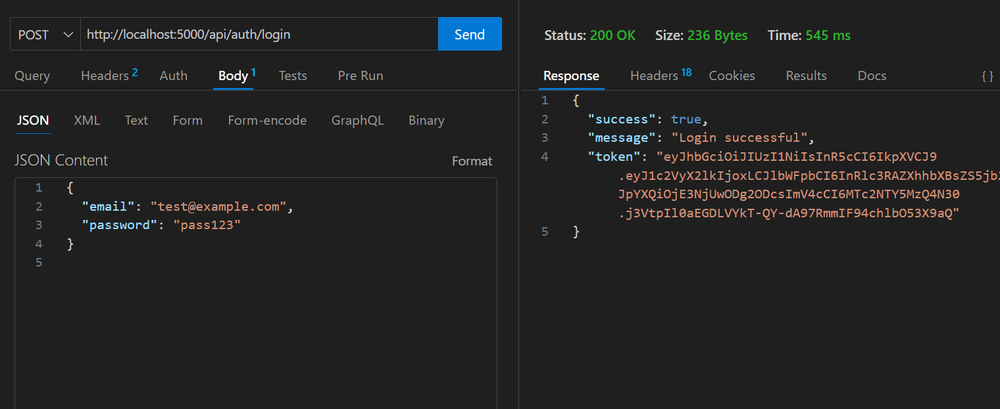
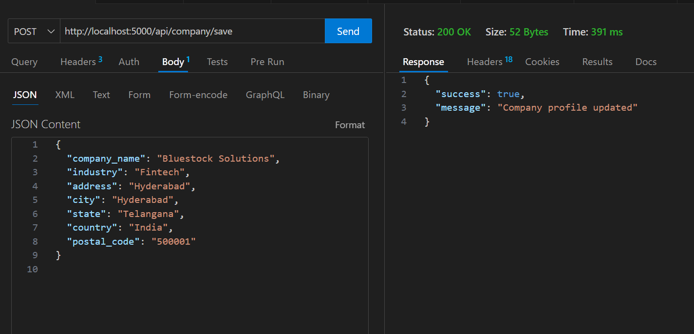
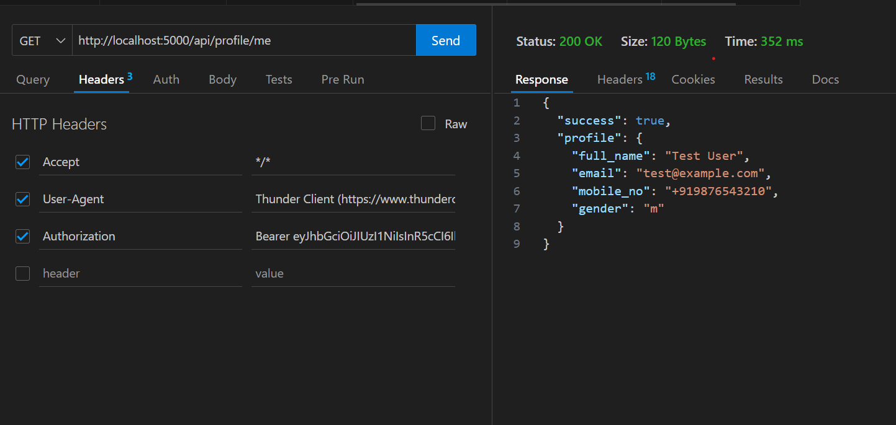

### 🚀 Bluestock Fintech — Warm-Up Backend Assignment

A backend application built as part of Bluestock SWE internship warm-up, implementing authentication, secure routing, PostgreSQL persistence and company profile APIs. 
  
🔥 Overview
This project demonstrates:

✔ Node.js API development
✔ Authentication and JWT security
✔ Database CRUD operations
✔ MVC style structure
✔ Documentation and API testing proof

---

### 🏗 Tech Stack 
Component	Technology
Runtime	Node.js
Framework	Express.js
Database	PostgreSQL
Auth	JWT
Password Hashing	bcrypt
Config	dotenv
Testing	Thunder Client / Postman

---

### 📌 Key Features
✔ Register users into database
✔ Validate login and generate JWT
✔ Protect routes using middleware
✔ Create or update company profile
✔ Fetch authenticated user's company profile
✔ Clean folder structure and reusable modules

---

### 📁 Folder Layout
backend/
 ├── src/
 │   ├── config/
 │   ├── controllers/
 │   ├── middleware/
 │   ├── routes/
 │   ├── tests/
 │   └── server.js
 ├── README.md
 └── .gitignore

### ⚙️ Installation & Setup
1️⃣ Install dependencies
npm install

2️⃣ Create .env file
PORT=5000
DB_HOST=localhost
DB_PORT=5432
DB_USER=postgres
DB_PASSWORD=yourpassword
DB_NAME=company_db
JWT_SECRET=mysecretkey

⚠️ Do not upload .env to GitHub.

3️⃣ Start server
npm run dev

The backend runs at:
👉 http://localhost:5000

🔐 API Endpoints
✳ Authentication
Method	Endpoint	Purpose
POST	/api/auth/register	Register user
POST	/api/auth/login	Login + JWT token
✳ Company Profile (Protected)
Method	Endpoint
POST	/api/company/save
GET	/api/company/me

### 🔑 Authorization Header Required:

Authorization: Bearer <token>

### 📌 Sample Profile Payload
{
  "company_name": "Bluestock Solutions",
  "industry": "Fintech",
  "address": "Hyderabad",
  "city": "Hyderabad",
  "state": "Telangana",
  "country": "India",
  "postal_code": "500001"
}

### 🧪 Testing Guide (Runbook)

Register a user

Login → Copy the token

Hit /api/company/save with Authorization header

Fetch profile using /api/company/me

Simple validation ensures data integrity.

## 📸 Screenshots (Execution Proof)

### 🔹 pgAdmin server connected

### 🔹 Users table created
.png)

### 🔹 Company Profile table created
.png)

### 🔹 Database tables visible
.png)

### 🔹 Register API (User Signup)

### 🔹 Login API (JWT Generated)

### 🔹 Company Profile Save API

### 🔹 Fetch Company Profile API

---

### Example usage in README:

🔹 User Registration

🔹 Company Profile Save

🔹 Profile Fetch

These verify that the backend was tested successfully.

🗄 Database Design

Tables:

users → stores auth details

company_profile → stores company details linked via foreign key

### ✨ Improvements Implemented

✔ Validation middleware
✔ Centralized database connection
✔ Protected routes
✔ User-scoped profile access

👨‍💻 Project Use Case

Designed to demonstrate backend fundamentals for full-stack development and production-best practices.

---

### 📝 Submitted For

Bluestock Fintech SWE Internship Warm-Up Assignment
Developed by Junaid

### ⭐ Feedback / Suggestions Welcome

Feel free to fork, improve or extend this project.

---

### 🎉 Thank you for reviewing!

You can paste this as-is in GitHub README — looks professional and complete.

